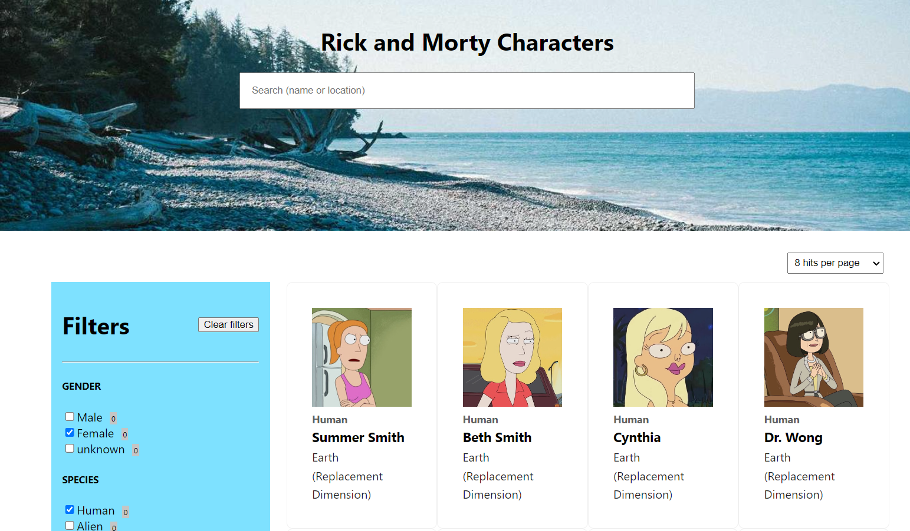
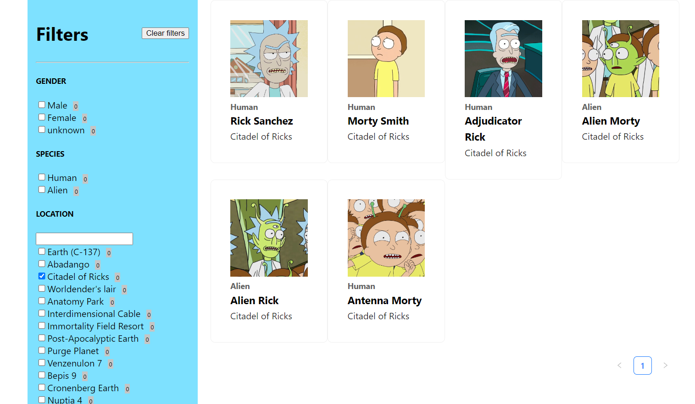

# React Rick and Morty Characters :star::heart:

This project assignment has been prepared for the 'Kodluyoruz' GraphQL React course. A React application where we can list, search and filter Rick and Morty characters using an existing GraphQL backend
 
 **backend:** https://rickandmortyapi.com/graphql

 ---

 

 ---

 
